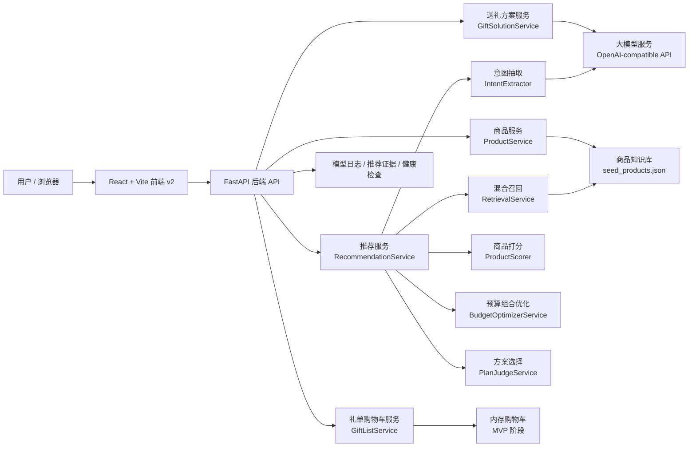
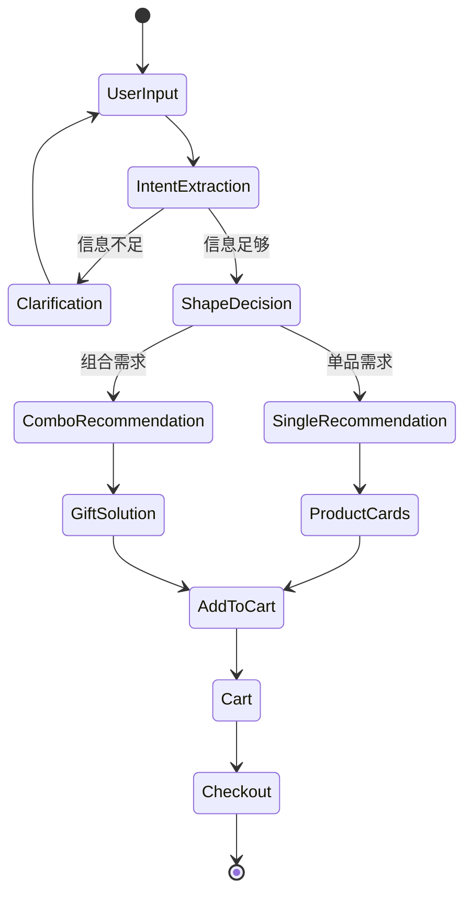
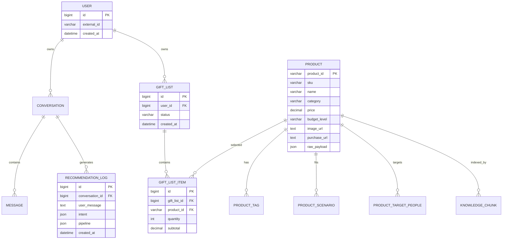
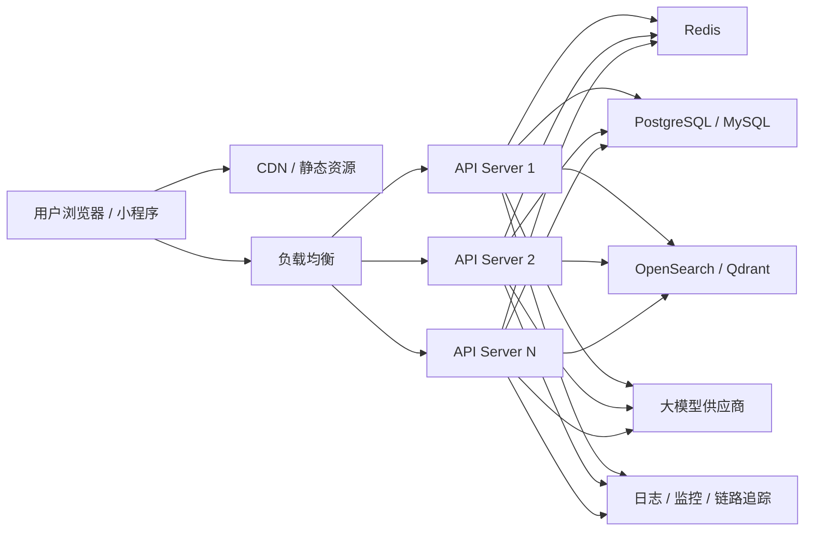

# 京礼 AI 导购 MVP 技术方案

## 1. 运营现状与发展规划

### 1.1 运营现状

京礼 AI 导购当前处于 MVP 验证阶段，目标是验证一条完整的 AI 导购链路：

```text
用户表达送礼需求
  -> AI 理解送礼意图
  -> 后端基于真实商品库推荐商品
  -> 生成单品/组合送礼方案
  -> 前端展示商品卡片
  -> 加入购物车/礼单
```

当前已具备能力：

- v2 移动端前端页面：包括首页、AI 送礼画像页、推荐结果页、搜索页、购物车页。
- FastAPI 后端：提供商品、搜索、推荐、送礼方案、购物车、健康检查等接口。
- 商品知识库：使用 `storage/sample_docs/seed_products.json` 存放真实商品数据。
- AI 推荐链路：已从“直接让大模型推荐”升级为“意图抽取 + 混合召回 + 商品打分 + 预算组合优化 + 大模型解释”。
- 支持两种推荐形态：
  - 单品推荐：识别用户只需要一个礼物时，返回 3 个候选单品。
  - 组合推荐：识别用户需要一套送礼方案时，返回主礼 + 副礼组合，并附带送礼建议。

### 1.2 发展规划

短期目标：

- 扩充真实商品库，覆盖更多送礼对象、场景、预算区间。
- 修复商品图片、价格、标签等基础数据质量问题。
- 完善前端演示链路，让推荐、加购、购物车体验稳定可演示。
- 增强推荐解释能力，让用户知道“为什么推荐这个商品”。

中期目标：

- 引入数据库，替代本地 JSON 和内存购物车。
- 引入搜索引擎或向量数据库，提升召回质量与扩展能力。
- 接入用户反馈数据，例如点击、加购、不喜欢、购买，用于优化推荐排序。
- 建立推荐评估集，持续追踪预算命中率、场景命中率、加购转化率。

长期目标：

- 建设可配置、可观测、可灰度的 AI 导购推荐平台。
- 支持多 Agent 或多工具协同，包括实时库存、实时价格、优惠信息、评价摘要、图片理解和用户画像。
- 支持 Web、小程序、APP、客服坐席等多渠道接入。

## 2. 系统架构设计

### 2.1 总体架构

系统采用前后端分离架构：

- 前端负责移动端交互、画像表单、商品卡片展示、购物车和搜索体验。
- 后端负责 API 编排、AI 意图抽取、商品召回、推荐排序、组合优化和购物车状态管理。
- 商品知识库当前使用本地 JSON 加载到内存，后续可迁移到数据库、搜索引擎和向量数据库。
- 大模型通过 OpenAI-compatible 客户端接入，支持真实模型和 mock 模式切换。

### 2.2 系统架构图



### 2.3 领域和服务拆分与依赖关系

| 领域 | 服务/模块 | 职责 | 依赖 |
|---|---|---|---|
| 前端交互 | `frontend/src/v2` | v2 移动端页面、表单、推荐卡片、购物车、搜索 | 后端 API |
| 商品域 | `ProductService` / `ProductRepository` | 商品列表、商品详情、关键词搜索 | 商品知识库 |
| 知识库域 | `SeedProductCatalog` / `KnowledgeStore` | 加载商品 JSON、校验商品字段、构建知识片段 | `seed_products.json` |
| 意图域 | `IntentExtractor` | 将自然语言解析为结构化送礼意图 | LLM、规则兜底 |
| 推荐域 | `RecommendationService` | 推荐主流程编排 | 意图、召回、打分、优化 |
| 召回域 | `RetrievalService` | 关键词召回、本地语义召回、结构化召回 | 商品知识库 |
| 排序域 | `ProductScorer` | 单品相关度、预算、偏好、禁忌等打分 | `GiftIntent`、商品字段 |
| 优化域 | `BudgetOptimizerService` | 组合枚举、预算约束、主副礼结构优化 | 排序候选商品 |
| 方案域 | `GiftSolutionService` | 生成单品/组合送礼方案、话术、时机、包装建议 | 推荐结果、LLM |
| 礼单域 | `GiftListService` | 加入购物车、移除、合计金额 | 内存仓库，后续数据库 |
| 观测域 | `ModelLogService` / `EvalService` | 模型日志、推荐评估、链路调试 | 后端服务 |

## 3. 技术选型

### 3.1 当前 MVP 技术栈

| 层级 | 技术选型 | 说明 |
|---|---|---|
| 前端框架 | React + TypeScript | 组件化、类型安全，适合快速构建移动端原型 |
| 构建工具 | Vite | 启动快、开发体验好 |
| 样式方案 | Tailwind CSS + 自定义 CSS | 快速实现移动端视觉 |
| 前端路由 | React Router | 支持多页面原型 |
| 后端语言 | Python | AI 应用生态成熟，便于算法迭代 |
| 后端框架 | FastAPI | 自动生成接口文档，支持异步和 Pydantic 校验 |
| 数据校验 | Pydantic | 商品、意图、推荐结果、API 入参统一校验 |
| 商品数据 | JSON 文件 | MVP 阶段简单、透明、易编辑 |
| 检索能力 | 内存关键词检索 + 本地语义召回 | 不依赖外部服务，便于快速验证 |
| 大模型 | OpenAI-compatible LLM Client | 支持多模型供应商切换 |
| 中间件 | 暂无独立中间件 | MVP 降低系统复杂度 |
| 部署方式 | 本地前后端分离启动 | 后续迁移 Docker / 云服务 |

### 3.2 后续生产化技术选型

| 能力 | 建议选型 |
|---|---|
| 关系型数据库 | PostgreSQL / MySQL |
| 缓存与会话 | Redis |
| 搜索引擎 | OpenSearch / Elasticsearch |
| 向量数据库 | Qdrant / Milvus / pgvector |
| 对象存储 | S3 / OSS / COS |
| API 网关 | Nginx / 云 API Gateway |
| 部署 | Docker / Kubernetes |
| 监控 | Prometheus + Grafana |
| 日志 | Loki / ELK |
| 链路追踪 | OpenTelemetry |
| CI/CD | GitHub Actions / GitLab CI |

### 3.3 技术架构简版

前端：

- React + Vite + Tailwind CSS
- 采用移动端优先的响应式设计，当前主入口为 v2 移动端原型。

后端：

- Python + FastAPI
- 负责商品服务、推荐服务、送礼方案生成、购物车/礼单接口和健康检查。

AI 服务：

- OpenAI-compatible LLM Client
- 当前可对接智谱、通义千问、DeepSeek 等兼容 OpenAI 协议的模型服务。
- 大模型主要承担意图抽取、推荐解释、送礼话术和方案生成。

推荐算法：

- 意图抽取 + 混合召回 + 商品打分 + 预算组合优化 + 大模型解释。
- 商品推荐不直接交给大模型自由发挥，而是基于真实商品库和算法候选生成。

商品知识库：

- MVP 阶段使用 `storage/sample_docs/seed_products.json`。
- 后端启动时加载到内存，并构建关键词检索和本地语义召回所需的商品知识片段。

语音识别：

- 当前 MVP 暂未接入语音识别。
- 后续可扩展接入通义千问 `Qwen3-ASR-Flash` 等语音识别模型，用于“语音描述送礼需求 -> 文本意图抽取”。

样式：

- Tailwind CSS + 自定义 CSS。
- 视觉上采用移动端优先、类 App 手机壳布局、白底轻奢风格和商品卡片化展示。

## 4. AI 推荐算法设计

### 4.1 推荐链路

当前推荐不是由大模型直接读取全部商品库并自由推荐，而是采用可控的混合式推荐链路：

```text
用户输入
  -> 意图结构化抽取
  -> 是否需要追问
  -> 单品/组合推荐判断
  -> 混合召回候选商品
  -> 商品打分排序
  -> 预算与组合优化
  -> 大模型基于候选商品生成推荐解释和送礼方案
```

### 4.2 意图抽取

用户输入会被解析为 `GiftIntent`，主要字段如下：

| 字段 | 含义 |
|---|---|
| `recipient` | 送礼对象，如女朋友、父母、领导、客户 |
| `relationship` | 关系分寸，如亲密关系、长辈关系、商务关系 |
| `scenario` / `scenarios` | 送礼场景，如生日、见家长、乔迁、婚礼 |
| `budget` | 用户预算 |
| `budget_constraint_type` | 预算强度：`hard` / `soft` / `negotiable` / `unknown` |
| `budget_upper_bound` | 根据预算语义计算出的预算上限 |
| `preferences` | 偏好，如咖啡、茶、香氛、数码 |
| `gift_style` | 风格，如体面、实用、浪漫、健康 |
| `avoid` | 禁忌或不想要的方向 |
| `target_people` | 商品库匹配用的人群标签 |
| `budget_level` | 预算档位：`low` / `mid` / `high` / `luxury` |

预算语义：

- `hard`：如“500 以内、不超过 500”，预算不允许浮动。
- `soft`：如“500 左右、大概 500”，默认允许 15% 浮动。
- `negotiable`：如“预算可以加一点”，默认允许 30% 浮动。

### 4.3 召回算法

混合召回包括：

1. 结构化召回：基于场景、人群、预算档位、价格过滤商品。
2. 关键词召回：对商品知识文本做关键词命中和词频打分。
3. 本地语义召回：将 query 和商品文本转成稀疏 token 向量，计算余弦相似度。
4. 放宽召回：严格条件无结果时，逐步放宽人群/场景等条件。
5. 兜底召回：返回通用礼品候选，避免无推荐结果。

检索 query 由以下字段拼接：

```text
用户原始输入
+ 主场景 scenario
+ 偏好 preference
+ 场景列表 scenarios
+ 目标人群 target_people
+ 固定补充词：组合礼单 / 送礼 / 礼物 / 预算 / 场景
```

### 4.4 单品打分

单品打分权重：

| 打分项 | 权重 |
|---|---:|
| 场景匹配 | 30 |
| 人群匹配 | 25 |
| 预算匹配 | 20 |
| 偏好匹配 | 8 / 命中词 |
| 风格匹配 | 8 / 命中词 |
| 评价表现 | 6 |
| 商品卖点完整度 | 3 |
| 禁忌命中惩罚 | -35 / 命中词 |
| 明显超预算惩罚 | -28 |
| 价格未知惩罚 | -6 |

### 4.5 组合优化数学形式

组合推荐可以抽象为带约束的组合优化问题。给定候选商品集合：

$$
\mathcal{P} = \{p_1, p_2, \dots, p_n\}
$$

定义二元决策变量：

$$
x_i =
\begin{cases}
1, & \text{商品 } p_i \text{ 被选入推荐方案} \\
0, & \text{商品 } p_i \text{ 未被选入推荐方案}
\end{cases}
$$

目标函数为：

$$
\max_{\mathbf{x}} \quad
F(\mathbf{x}) =
0.55 \cdot R(\mathbf{x})
+ 0.20 \cdot B(\mathbf{x})
+ 0.15 \cdot D(\mathbf{x})
+ 0.10 \cdot C(\mathbf{x})
- P(\mathbf{x})
$$

其中：

$$
R(\mathbf{x}) =
\min\left(
\frac{\sum_{i=1}^{n} x_i \cdot rel_i}
{100 \cdot \sum_{i=1}^{n} x_i},
1
\right)
$$

表示组合整体相关度。

$$
B(\mathbf{x}) =
\begin{cases}
1.00, & 0.65 \leq \frac{\sum_i x_i price_i}{U} \leq 1 \\
0.75, & 0.35 \leq \frac{\sum_i x_i price_i}{U} < 0.65 \\
0.45, & 0 < \frac{\sum_i x_i price_i}{U} < 0.35 \\
0, & \frac{\sum_i x_i price_i}{U} > 1
\end{cases}
$$

表示预算使用合理性，$U$ 为预算语义上限。

$$
D(\mathbf{x}) =
0.65 \cdot
\frac{|\{cat_i \mid x_i = 1\}|}{\sum_i x_i}
+ 0.35 \cdot
\frac{|\bigcup_{x_i=1} tag_i|}{2 \cdot \sum_i x_i}
$$

表示品类和标签多样性。

约束条件：

$$
\sum_{i=1}^{n} x_i price_i \leq U
$$

预算约束。

$$
1 \leq \sum_{i=1}^{n} x_i \leq K
$$

商品数量约束。

$$
match(p_i, intent) = 1 \quad \text{or} \quad relax(intent) = 1
$$

场景、人群和偏好约束。

$$
\exists p_m \in \mathcal{P}, \quad role(p_m) = main\_gift
$$

主礼约束。

$$
price_m \geq \alpha \cdot \min(price_j), \quad j \neq m, x_j = 1
$$

主副礼层次约束。当前实现中 $\alpha \approx 1.5$。

MVP 当前没有引入外部数学规划求解器，而是在召回后的 Top 16 候选商品中枚举组合，计算目标函数并选择得分最高的方案。

## 5. API 接口设计

### 5.1 接口列表

| 接口 | 方法 | 说明 |
|---|---|---|
| `/api/health/ready` | GET | 健康检查 |
| `/api/products` | GET | 获取商品列表 |
| `/api/products/search` | GET | 商品关键词搜索 |
| `/api/chat/stream` | POST | 聊天式流式推荐 |
| `/api/recommendations` | POST | 推荐算法接口 |
| `/api/gift-solution/generate` | POST | 生成单品/组合送礼方案 |
| `/api/gift-plan/generate` | POST | 生成结构化组合礼单 |
| `/api/gift-list` | GET | 获取购物车/礼单 |
| `/api/gift-list/items` | POST | 加入购物车 |
| `/api/gift-list/items/{product_id}` | DELETE | 从购物车移除 |
| `/api/eval/model-logs` | GET | 查看模型调用日志 |

### 5.2 请求/响应格式

#### 5.2.1 生成送礼方案

请求：

```http
POST /api/gift-solution/generate
Content-Type: application/json
```

```json
{
  "message": "见家长，预算2000左右，想要体面一点",
  "conversation_id": "demo-session-001",
  "max_products": 3,
  "strategy": "hybrid_algorithm"
}
```

响应：

```json
{
  "shape_decision": {
    "shape": "combo_gift",
    "reason": "用户需要完整送礼方案，适合主礼加副礼组合",
    "recommended_product_count": 3
  },
  "products": [
    {
      "product_id": "100064",
      "name": "剑南春水晶剑52度浓香型白酒500ml*2瓶礼盒装",
      "price": 898,
      "gift_role": "main_gift",
      "reason": "匹配商务送礼场景，同时适合商务人士"
    }
  ],
  "solution": {
    "summary": "这套方案主打体面、稳重和实用。",
    "gift_talk": "可以说这是特意挑选的一点心意。",
    "timing": "建议在正式拜访时递上。",
    "place": "适合在对方家中或工作环境优雅处赠送。",
    "packaging": "建议使用礼袋并附手写卡片。",
    "avoid_tips": ["不要主动强调价格", "不要过度推销产品功能"]
  }
}
```

#### 5.2.2 商品搜索

请求：

```http
GET /api/products/search?q=白酒&limit=20
```

响应：

```json
{
  "items": [
    {
      "product_id": "100064",
      "name": "剑南春水晶剑52度浓香型白酒500ml*2瓶礼盒装",
      "price": 898,
      "image_url": "https://example.com/product.jpg",
      "tags": ["白酒", "商务送礼"]
    }
  ]
}
```

#### 5.2.3 加入购物车

请求：

```http
POST /api/gift-list/items
Content-Type: application/json
```

```json
{
  "product_id": "100064",
  "quantity": 1
}
```

响应：

```json
{
  "items": [
    {
      "product_id": "100064",
      "quantity": 1,
      "subtotal": 898
    }
  ],
  "total_amount": 898
}
```

### 5.3 推荐状态机



## 6. 数据库设计

### 6.1 当前 MVP 数据形态

当前 MVP 暂未接入正式数据库：

- 商品数据：`storage/sample_docs/seed_products.json`
- 商品知识切片：后端启动时加载到内存 `KnowledgeStore`
- 购物车/礼单：内存存储，后端重启后清空
- 模型日志：服务内记录，可通过接口查询

### 6.2 目标 ER 图



### 6.3 表结构和索引说明

#### `products`

| 字段 | 类型 | 说明 |
|---|---|---|
| `product_id` | varchar PK | 商品唯一 ID |
| `sku` | varchar | 外部平台 SKU |
| `name` | varchar | 商品名 |
| `brand` | varchar | 品牌 |
| `category` | varchar | 一级品类 |
| `subcategory` | varchar | 二级品类 |
| `price` | decimal | 当前价格 |
| `budget_level` | varchar | 预算档位 |
| `image_url` | text | 商品图片 |
| `purchase_url` | text | 购买链接 |
| `status` | varchar | 商品状态 |
| `raw_payload` | json | 扩展字段 |
| `created_at` / `updated_at` | datetime | 时间字段 |

建议索引：

- `idx_products_category`
- `idx_products_price`
- `idx_products_budget_level`
- `idx_products_status`
- `idx_products_name_fulltext`

#### `product_tags` / `product_scenarios` / `product_target_people`

用于结构化召回。

建议索引：

- `idx_product_tags_tag`
- `idx_product_scenarios_scenario`
- `idx_product_target_people_people`

#### `knowledge_chunks`

| 字段 | 类型 | 说明 |
|---|---|---|
| `chunk_id` | varchar PK | 知识切片 ID |
| `product_id` | varchar FK | 商品 ID |
| `text` | text | 商品知识文本 |
| `embedding` | vector/json | 向量字段，后续扩展 |
| `created_at` | datetime | 创建时间 |

建议索引：

- 文本索引：支持关键词检索。
- 向量索引：支持语义召回。

#### `gift_lists` / `gift_list_items`

建议索引：

- `idx_gift_lists_user_id_status`
- `idx_gift_list_items_list_id`
- `idx_gift_list_items_product_id`

#### `recommendation_logs`

建议索引：

- `idx_recommendation_logs_conversation_id`
- `idx_recommendation_logs_created_at`
- `idx_recommendation_logs_strategy`

## 7. 非功能性设计

### 7.1 性能与容量

MVP 阶段目标：

- 单机演示 QPS：1-5。
- 商品搜索接口 P95：300ms 内。
- 推荐接口：
  - 不调用真实大模型：500ms-1500ms。
  - 调用真实大模型：3s-15s，取决于模型服务。
- 商品库规模：当前百级，可支撑 MVP 演示。

生产阶段目标：

- 推荐接口 P95 控制在 3s 内。
- 流式回复首 token 控制在 1s-2s。
- 支持 100+ QPS。
- 商品规模支持 10 万级以上。

容量规划：

- API 服务无状态部署，通过增加实例水平扩容。
- 商品检索迁移到 OpenSearch/Qdrant 后，由检索集群承载召回压力。
- Redis 缓存热门商品、热门推荐、会话状态。
- LLM 调用增加并发控制、超时和降级。

### 7.2 可读与延展

模块化设计：

- 意图抽取、召回、打分、组合优化、送礼解释拆分为独立服务。
- 推荐权重、预算策略、召回策略后续可配置化。
- 本地语义召回可以替换为向量数据库，不影响推荐主流程。
- 购物车内存实现可以替换为数据库实现，不影响前端接口。

无状态扩展：

- API 层尽量保持无状态。
- 会话、购物车、用户画像后续迁移到 Redis/数据库。
- 多实例可通过负载均衡水平扩展。

### 7.3 监控与告警

指标监控：

- API QPS、错误率、P50/P95/P99 延迟。
- LLM 调用次数、耗时、失败率、超时率。
- 推荐召回数量、空召回率、预算命中率、场景命中率。
- 商品搜索次数、加购率、点击率、不喜欢率。

日志：

- 请求日志：trace_id、接口、耗时、状态码。
- 推荐日志：意图结果、召回数量、候选商品、打分证据、最终方案。
- 模型日志：模型名、prompt 名称、耗时、错误信息。

链路追踪：

```text
前端请求
  -> API
  -> 意图抽取
  -> 商品召回
  -> 商品打分
  -> 组合优化
  -> LLM 解释
  -> 前端展示
```

分级告警：

- P1：服务不可用、推荐接口错误率超过 20%、LLM 全部失败。
- P2：推荐接口 P95 显著升高、商品库加载失败、空召回率异常。
- P3：单模型供应商波动、部分接口慢查询、图片加载失败率升高。

### 7.4 安全

认证授权：

- MVP 阶段仅本地演示，可以不启用登录。
- 生产阶段接入 JWT / OAuth2 / 企业 SSO。
- 商品管理、策略配置、日志查询等后台接口需要管理员权限。

数据加密：

- 全站 HTTPS。
- API Key、数据库密码等敏感信息使用环境变量或密钥管理服务。
- 数据库存储敏感字段时进行加密或脱敏。

内容安全：

- 限制用户输入长度。
- 大模型输出必须基于候选商品，不允许编造商品。
- 对 Prompt 注入、敏感词、违规内容进行过滤。

### 7.5 容错与故障恢复

容错策略：

- LLM 调用失败时降级到规则推荐和模板回复。
- 召回为空时触发放宽召回和兜底召回。
- 商品图片加载失败时前端展示占位图。
- 商品库校验失败时后端启动失败并输出明确错误。

故障恢复：

- API 服务无状态，异常实例可直接重启。
- 数据库定期备份，支持按时间点恢复。
- 商品库、Prompt、推荐权重全部版本化，支持快速回滚。

## 8. 部署与运维方案

### 8.1 部署架构

MVP 本地部署：

```text
浏览器
  -> Vite 前端 localhost:3000
  -> FastAPI 后端 localhost:8000
  -> 本地商品 JSON
  -> 外部大模型 API
```

生产建议部署：



高可用设计：

- 前端静态资源部署到 CDN。
- 后端 API 多实例无状态部署。
- 负载均衡自动摘除异常实例。
- Redis、数据库、搜索引擎使用高可用集群或云托管版本。
- LLM 接入配置超时、重试、熔断和备用模型。
- 对推荐接口、搜索接口增加限流，防止突发流量打垮系统。

### 8.2 CI/CD 流程

建议流程：

```text
开发分支提交
  -> Pull Request
  -> 代码检查
  -> 前端构建
  -> 后端测试
  -> 商品库校验
  -> Docker 镜像构建
  -> 测试环境部署
  -> 自动化冒烟测试
  -> 人工验收
  -> 生产环境发布
```

前端检查：

```bash
cd frontend
npm run build
```

后端检查：

```bash
cd backend
python -m app.scripts.validate_products
```

发布策略：

- 测试环境自动部署。
- 生产环境手动批准。
- 重要版本采用灰度发布或蓝绿发布。

### 8.3 回滚方案

触发条件：

- 新版本导致服务不可用。
- 推荐接口错误率显著升高。
- 商品推荐结果严重错误。
- 数据库迁移导致业务异常。
- Prompt 或算法策略导致大范围异常输出。

回滚步骤：

1. 暂停当前发布流水线。
2. 从负载均衡摘除新版本实例。
3. 后端镜像回滚到上一个稳定版本。
4. 前端静态资源回滚到上一个稳定版本。
5. 如果涉及数据库迁移，执行回滚脚本或恢复备份。
6. 如果涉及商品库、Prompt、推荐权重，回滚到上一个稳定配置。
7. 验证核心接口：
   - 健康检查。
   - 商品搜索。
   - 推荐生成。
   - 加入购物车。
8. 复盘故障原因，补充测试和告警。

回滚原则：

- 代码、配置、商品数据、Prompt、算法权重均需版本化。
- 数据库变更优先采用向前兼容设计。
- 推荐策略上线需要支持灰度和快速开关。

## 9. 总结

京礼 AI 导购 MVP 当前已经打通从自然语言需求到真实商品推荐的核心闭环。系统的关键特点是：不把推荐完全交给大模型自由发挥，而是通过结构化意图、混合召回、规则打分、预算组合优化和大模型解释共同完成推荐。

该方案在 MVP 阶段保持实现简单、链路透明、便于演示；后续可以通过数据库、搜索引擎、向量检索、用户反馈和监控体系逐步演进为生产级 AI 导购平台。
