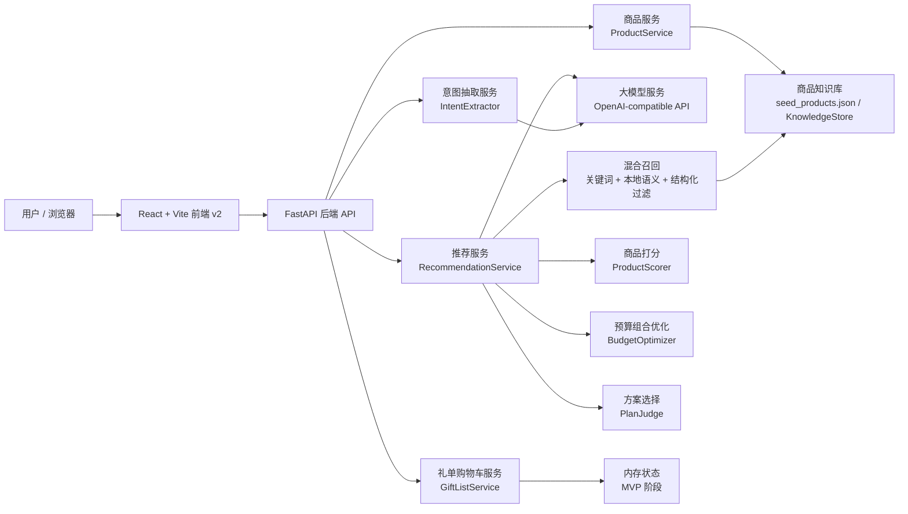
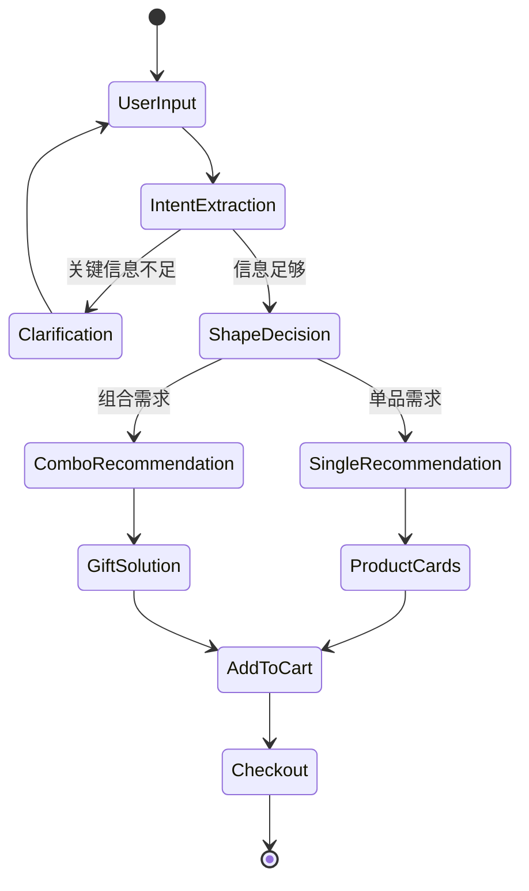
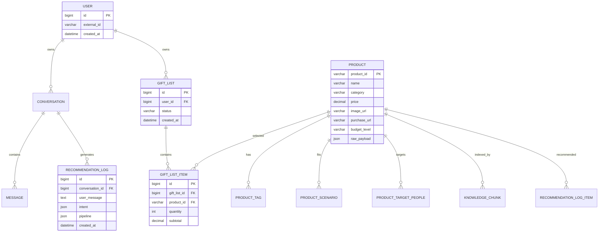
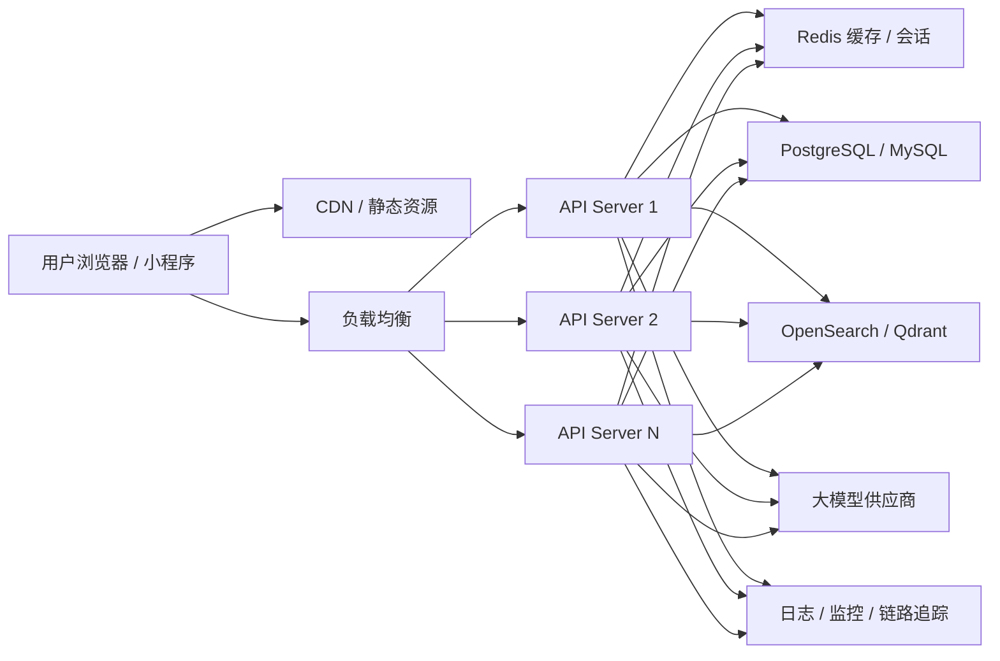

# 京礼 AI 导购 MVP 技术方案

## 1. 运营现状与发展规划

### 1.1 运营现状

京礼 AI 导购当前处于 MVP 验证阶段，核心目标是验证“自然语言送礼需求 -> AI 理解意图 -> 商品推荐 -> 送礼方案 -> 加入购物车”的完整闭环。

当前已完成能力：

- 移动端 v2 前端原型，包含首页、AI 送礼画像表单、推荐结果页、购物车页和搜索页。
- FastAPI 后端服务，提供商品、送礼推荐、礼单购物车、健康检查等接口。
- 商品知识库采用 `storage/sample_docs/seed_products.json`，当前以本地 JSON 种子数据承载真实商品信息。
- AI 推荐链路已从“直接调用大模型”升级为“意图抽取 + 混合召回 + 商品打分 + 预算组合优化 + 大模型解释”的混合式推荐方案。
- 支持单品推荐与组合推荐分流：
  - 单品推荐：返回 3 个候选商品，给用户选择。
  - 组合推荐：返回主礼 + 副礼组合，并生成送礼话术、时机、地点、包装和避坑建议。

### 1.2 发展规划

短期目标：

- 扩充真实商品库，提高不同场景、预算、人群下的覆盖率。
- 完善商品搜索、加购、结算前链路，提升 Demo 可演示性。
- 完善推荐解释、证据链和调试日志，便于排查“为什么推荐这个商品”。

中期目标：

- 引入持久化数据库，替代内存礼单和本地 JSON 商品库。
- 引入向量检索或搜索引擎，提高召回质量和规模承载能力。
- 引入用户反馈闭环，例如点击、加购、不喜欢、购买等行为，优化排序策略。
- 建立推荐效果评估集，持续追踪预算命中率、场景命中率、加购转化率等指标。

长期目标：

- 建设面向多业务场景的 AI 导购平台，支持商品库接入、策略配置、A/B 实验、效果监控和多渠道部署。
- 支持多 Agent 或多工具协同，包括实时价格、库存、优惠、评价摘要、图片理解和个性化用户画像。

## 2. 系统架构设计

### 2.1 总体架构

系统采用前后端分离架构：

- 前端负责移动端交互、画像表单、推荐结果展示、购物车和搜索。
- 后端负责 API 编排、AI 意图抽取、商品召回、推荐排序、组合优化、礼单状态管理。
- 商品知识库当前以本地 JSON 加载到内存，后续可迁移至数据库和向量检索系统。
- 大模型通过 OpenAI-compatible 客户端接入，支持真实模型与 mock 模式切换。

### 2.2 系统架构图



### 2.3 领域和服务拆分与依赖关系

| 领域 | 服务/模块 | 职责 | 依赖 |
|---|---|---|---|
| 用户交互 | `frontend/src/v2` | 移动端页面、表单、推荐卡片、购物车、搜索 | 后端 API |
| 商品域 | `ProductService` / `product_repo` | 商品列表、商品搜索、商品卡片数据 | 商品知识库 |
| 知识库域 | `SeedProductCatalog` / `KnowledgeStore` | 加载商品 JSON、校验、构建知识片段 | `seed_products.json` |
| 意图域 | `IntentExtractor` | 将用户自然语言转成结构化送礼意图 | LLM、规则兜底 |
| 推荐域 | `RecommendationService` | 推荐主流程编排 | 意图、召回、打分、优化、LLM |
| 召回域 | `RetrievalService` | 关键词召回、本地语义召回 | KnowledgeStore、商品库 |
| 排序域 | `ProductScorer` | 商品单品打分与解释 | GiftIntent、商品字段 |
| 优化域 | `BudgetOptimizerService` | 单品/组合方案生成，预算约束和主副礼结构 | 排序候选 |
| 解释域 | `GiftSolutionService` / LLM Prompt | 生成送礼方案、话术、时机、包装建议 | LLM、候选商品 |
| 礼单域 | `GiftListService` | 加入购物车、删除、统计金额 | 内存仓库，后续数据库 |
| 观测域 | `ModelLogService` / eval | 模型调用日志、推荐评估 | 后端服务 |

## 3. 技术选型

| 层级 | 当前 MVP 选型 | 说明 | 后续演进 |
|---|---|---|---|
| 前端框架 | React + TypeScript + Vite | 开发速度快，适合移动端 Demo 和组件化迭代 | 可继续保持 |
| 样式方案 | Tailwind CSS + 自定义 CSS | 快速实现 v2 移动端视觉 | 可沉淀设计系统 |
| 路由 | React Router | 支持多页面原型 | 可扩展权限路由 |
| 后端语言 | Python | AI 应用生态成熟，便于算法迭代 | 可继续保持 |
| 后端框架 | FastAPI | 类型友好、接口文档自动生成、异步支持好 | 可用于生产 |
| 数据校验 | Pydantic | 商品、意图、推荐结果 schema 校验 | 可继续保持 |
| 商品库 | 本地 JSON + 内存加载 | MVP 简单可控，便于快速改商品 | PostgreSQL / MySQL |
| 知识检索 | 内存 KnowledgeStore | 关键词检索 + 本地稀疏语义召回 | Elasticsearch / OpenSearch / Qdrant |
| 大模型接入 | OpenAI-compatible LLM Client | 支持多供应商切换和 mock 模式 | 增加模型路由和降级策略 |
| 中间件 | 当前暂无独立中间件 | MVP 低复杂度 | Redis 缓存、消息队列、对象存储 |
| 部署 | 本地开发启动 | 前后端分离 | Docker + Nginx + 云服务/K8s |

## 4. AI 推荐算法设计

### 4.1 算法目标

当前算法不是让大模型直接读取全部商品库自由推荐，而是采用可控的混合推荐架构：

```text
用户输入
  -> 意图结构化抽取
  -> 追问判断
  -> 单品/组合需求判断
  -> 混合召回
  -> 商品打分
  -> 预算与组合优化
  -> 大模型基于候选生成解释和送礼方案
```

设计目标：

- 降低大模型幻觉，保证推荐商品来自真实商品库。
- 让预算、场景、人群、偏好成为可计算约束。
- 支持单品推荐和组合推荐两种业务形态。
- 不只推荐商品，还输出“怎么送”的整体解决方案。

### 4.2 意图抽取

用户输入会被解析为 `GiftIntent`，主要字段包括：

| 字段 | 含义 |
|---|---|
| `recipient` | 送礼对象，如女朋友、父母、领导 |
| `relationship` | 关系分寸，如亲密关系、长辈关系、商务关系 |
| `scenario` / `scenarios` | 送礼场景，如生日、见家长、乔迁 |
| `budget` | 用户预算数字 |
| `budget_constraint_type` | 预算强度：`hard` / `soft` / `negotiable` / `unknown` |
| `budget_upper_bound` | 根据预算语义计算出的预算上限 |
| `preferences` | 明确偏好，如咖啡、茶、香氛、数码 |
| `gift_style` | 风格偏好，如体面、实用、浪漫、健康 |
| `avoid` | 禁忌或不想要的方向 |
| `target_people` | 用于匹配商品库的人群标签 |
| `budget_level` | 预算档位：`low` / `mid` / `high` / `luxury` |

预算语义规则：

- “500以内、不超过500、最多500”：硬约束，不允许浮动。
- “500左右、大概500、约500”：软约束，默认允许 15% 浮动。
- “预算可以加一点、可以放宽”：可协商，默认允许 30% 浮动。

### 4.3 召回算法

当前采用混合召回：

1. 结构化召回：基于 `scenarios`、`target_people`、`budget_level`、价格过滤商品库。
2. 关键词召回：将商品知识文本切片后，用关键词命中和词频打分返回 Top K。
3. 本地语义召回：将 query 和商品文本转成稀疏 token 向量，用余弦相似度召回。
4. 放宽召回：当条件过严无结果时，逐步放宽人群/场景等条件。
5. 兜底召回：返回通用礼品候选，避免无结果。

拼接后的检索 query 由以下字段组成：

```text
用户原始输入
+ 主场景 scenario
+ 偏好 preference
+ 场景列表 scenarios
+ 目标人群 target_people
+ 固定补充词：组合礼单 / 送礼 / 礼物 / 预算 / 场景
```

大模型不会直接读取全部商品库进行匹配。商品候选由本地召回算法产生，大模型主要负责意图抽取和最终自然语言解释。

### 4.4 单品打分

单个商品打分权重：

| 打分项 | 权重 |
|---|---:|
| 场景匹配 | 30 |
| 人群匹配 | 25 |
| 预算匹配 | 20 |
| 偏好匹配 | 8 / 命中词 |
| 风格匹配 | 8 / 命中词 |
| 评价表现 | 6 |
| 商品卖点完整度 | 3 |
| 禁忌命中惩罚 | -35 / 命中词 |
| 明显超预算惩罚 | -28 |
| 价格未知惩罚 | -6 |

### 4.5 组合优化目标函数

组合推荐可以抽象为一个带约束的组合优化问题。给定候选商品集合：

$$
\mathcal{P} = \{p_1, p_2, \dots, p_n\}
$$

为每个商品定义二元决策变量：

$$
x_i =
\begin{cases}
1, & \text{商品 } p_i \text{ 被选入推荐方案} \\
0, & \text{商品 } p_i \text{ 未被选入推荐方案}
\end{cases}
$$

其中每个商品包含价格 $price_i$、单品相关度分数 $rel_i$、品类 $cat_i$、标签集合 $tag_i$ 等属性。推荐目标是在满足预算、数量、场景和主副礼约束的前提下，最大化组合方案的综合效用：

$$
\max_{\mathbf{x}} \quad
F(\mathbf{x}) =
0.55 \cdot R(\mathbf{x})
+ 0.20 \cdot B(\mathbf{x})
+ 0.15 \cdot D(\mathbf{x})
+ 0.10 \cdot C(\mathbf{x})
- P(\mathbf{x})
$$

其中：

$$
R(\mathbf{x}) =
\min\left(
\frac{\sum_{i=1}^{n} x_i \cdot rel_i}
{100 \cdot \sum_{i=1}^{n} x_i},
1
\right)
$$

表示组合整体相关度；

$$
B(\mathbf{x}) =
\begin{cases}
1.00, & 0.65 \leq \frac{\sum_i x_i price_i}{U} \leq 1 \\
0.75, & 0.35 \leq \frac{\sum_i x_i price_i}{U} < 0.65 \\
0.45, & 0 < \frac{\sum_i x_i price_i}{U} < 0.35 \\
0, & \frac{\sum_i x_i price_i}{U} > 1
\end{cases}
$$

表示预算使用合理性，$U$ 为根据用户预算语义计算出的预算上限；

$$
D(\mathbf{x}) =
0.65 \cdot
\frac{|\{cat_i \mid x_i = 1\}|}{\sum_i x_i}
+ 0.35 \cdot
\frac{|\bigcup_{x_i=1} tag_i|}{2 \cdot \sum_i x_i}
$$

表示品类和标签多样性；

$$
C(\mathbf{x})
$$

表示主礼与副礼的互补性，当前规则会偏好“一个更贵重的主礼 + 一个或多个轻量副礼”的组合结构；

$$
P(\mathbf{x})
$$

表示超预算惩罚，惩罚强度由用户预算表达决定：`hard` 预算惩罚最高，`soft` 次之，`negotiable` 最低。

约束条件如下：

$$
\sum_{i=1}^{n} x_i price_i \leq U
$$

预算约束；

$$
1 \leq \sum_{i=1}^{n} x_i \leq K
$$

商品数量约束，$K$ 为最大推荐商品数；

$$
match(p_i, intent) = 1 \quad \text{or} \quad relax(intent) = 1
$$

场景、人群和偏好约束。若严格条件无结果，允许进入放宽召回；

$$
\exists p_m \in \mathcal{P}, \quad role(p_m) = main\_gift
$$

主礼约束。组合方案至少需要一个主礼；

$$
price_m \geq \alpha \cdot \min(price_j), \quad j \neq m, x_j = 1
$$

主副礼层次约束。当前实现中 $\alpha$ 取约 $1.5$，用于避免副礼比主礼更贵重。

当前 MVP 没有引入外部数学规划求解器，而是在召回后的 Top 16 候选商品中枚举组合，计算上述目标函数并选择得分最高的方案。这样可以在小规模候选集下保持实现简单、可解释、响应速度可控。

组合方案目标函数：

```text
objective_score =
  0.55 * relevance_score
+ 0.20 * budget_score
+ 0.15 * diversity_score
+ 0.10 * complement_score
- overage_penalty
```

| 维度 | 权重 | 说明 |
|---|---:|---|
| `relevance_score` | 55% | 商品与用户需求的整体相关性 |
| `budget_score` | 20% | 预算使用是否合理 |
| `diversity_score` | 15% | 商品品类和标签是否丰富 |
| `complement_score` | 10% | 主礼 + 副礼是否形成合理搭配 |
| `overage_penalty` | 扣分 | 根据预算强弱惩罚超预算 |

主副礼规则：

- 组合中相关度不明显掉队且价格更高的商品优先成为主礼。
- 主礼价格通常应高于副礼，避免“副礼压过主礼”。
- 品类不同、预算利用率合理的组合会获得更高搭配分。

### 4.6 大模型最终生成

大模型最终只接收算法筛出的候选商品和方案信息，用于生成：

- 推荐理由。
- 商品对比说明。
- 单品送礼建议。
- 组合送礼解决方案。
- 送礼话术、送礼时机、地点、包装建议和避坑提醒。

## 5. API 接口设计

### 5.1 接口列表

| 接口 | 方法 | 说明 |
|---|---|---|
| `/api/health/ready` | GET | 后端健康检查 |
| `/api/products` | GET | 获取商品列表 |
| `/api/products/search` | GET | 根据关键词搜索商品 |
| `/api/chat/stream` | POST | 聊天流式推荐 |
| `/api/recommendations` | POST | 推荐算法接口 |
| `/api/gift-solution/generate` | POST | 生成单品/组合送礼方案 |
| `/api/gift-plan/generate` | POST | 生成结构化组合礼单 |
| `/api/gift-list` | GET | 获取礼单购物车 |
| `/api/gift-list/items` | POST | 加入礼单 |
| `/api/gift-list/items/{product_id}` | DELETE | 移除礼单商品 |
| `/api/eval/model-logs` | GET | 查看模型调用日志 |

### 5.2 核心接口示例

#### 5.2.1 生成送礼解决方案

请求：

```http
POST /api/gift-solution/generate
Content-Type: application/json
```

```json
{
  "message": "见家长，预算2000左右，想要体面一点",
  "conversation_id": "demo-session-001",
  "max_products": 3,
  "strategy": "hybrid_algorithm"
}
```

响应：

```json
{
  "shape_decision": {
    "shape": "combo_gift",
    "reason": "用户需要完整送礼方案，适合主礼加副礼组合",
    "recommended_product_count": 3
  },
  "products": [
    {
      "product_id": "xxx",
      "name": "主礼商品",
      "price": 1280,
      "gift_role": "main_gift",
      "reason": "匹配见家长场景，同时价格在预算内"
    }
  ],
  "solution": {
    "summary": "这套方案主打体面、稳重和实用。",
    "gift_talk": "可以说这是特意挑选的一点心意。",
    "timing": "建议在正式拜访时递上。",
    "place": "适合在对方家中或见面入座后赠送。",
    "packaging": "建议使用礼袋并附手写卡片。",
    "avoid_tips": ["不要主动强调价格", "不要过度推销产品功能"]
  }
}
```

#### 5.2.2 商品搜索

请求：

```http
GET /api/products/search?q=白酒&limit=20
```

响应：

```json
{
  "items": [
    {
      "product_id": "100102181309",
      "name": "五粮液 精品 浓香型白酒",
      "price": 7999,
      "image_url": "https://...",
      "tags": ["高端", "白酒", "商务"]
    }
  ]
}
```

#### 5.2.3 加入礼单

请求：

```http
POST /api/gift-list/items
Content-Type: application/json
```

```json
{
  "product_id": "100102181309",
  "quantity": 1
}
```

响应：

```json
{
  "items": [
    {
      "product_id": "100102181309",
      "quantity": 1,
      "subtotal": 7999
    }
  ],
  "total_amount": 7999
}
```

### 5.3 推荐状态机



## 6. 数据库设计

### 6.1 当前 MVP 数据形态

当前 MVP 暂未接入正式数据库：

- 商品数据：`storage/sample_docs/seed_products.json`
- 商品知识切片：后端启动时加载到内存 `KnowledgeStore`
- 礼单购物车：内存存储，后端重启后清空
- 模型日志：当前以服务内记录和接口查询为主

### 6.2 目标数据库 ER 图



### 6.3 目标表结构与索引

#### `products`

| 字段 | 类型 | 说明 |
|---|---|---|
| `product_id` | varchar PK | 商品唯一 ID |
| `sku` | varchar | 外部平台 SKU |
| `name` | varchar | 商品名 |
| `brand` | varchar | 品牌 |
| `category` | varchar | 一级品类 |
| `subcategory` | varchar | 二级品类 |
| `price` | decimal | 当前价格 |
| `budget_level` | varchar | 预算档位 |
| `image_url` | text | 图片 |
| `purchase_url` | text | 购买链接 |
| `status` | varchar | 上架状态 |
| `raw_payload` | json | 原始扩展字段 |
| `created_at` / `updated_at` | datetime | 时间字段 |

建议索引：

- `idx_products_category`
- `idx_products_budget_level`
- `idx_products_price`
- `idx_products_status`
- `idx_products_name_fulltext`，用于搜索。

#### `product_tags` / `product_scenarios` / `product_target_people`

用于支持结构化过滤与召回。

建议索引：

- `idx_product_tags_tag`
- `idx_product_scenarios_scenario`
- `idx_product_target_people_people`

#### `knowledge_chunks`

| 字段 | 类型 | 说明 |
|---|---|---|
| `chunk_id` | varchar PK | 切片 ID |
| `product_id` | varchar FK | 商品 ID |
| `text` | text | 知识文本 |
| `embedding` | vector/json | 向量，后续接向量库 |
| `created_at` | datetime | 创建时间 |

建议索引：

- 文本索引：用于关键词检索。
- 向量索引：后续接 Qdrant / pgvector / Elasticsearch dense vector。

#### `gift_lists` / `gift_list_items`

用于购物车和礼单持久化。

建议索引：

- `idx_gift_lists_user_id_status`
- `idx_gift_list_items_list_id`
- `idx_gift_list_items_product_id`

#### `recommendation_logs`

用于推荐链路观测和效果评估。

建议索引：

- `idx_recommendation_logs_conversation_id`
- `idx_recommendation_logs_created_at`
- `idx_recommendation_logs_strategy`

## 7. 非功能性设计

### 7.1 性能与容量

MVP 阶段目标：

- 单机本地开发：支持 1-5 QPS 演示流量。
- 推荐接口响应：
  - 不调用真实大模型时：500ms-1500ms。
  - 调用真实大模型时：3s-15s，取决于模型服务。
- 商品库规模：当前百级，MVP 可扩展到千级。

生产阶段目标：

- 推荐接口 P95 响应时间控制在 3s 内，流式接口首 token 1s-2s。
- 商品搜索接口 P95 控制在 300ms 内。
- 支持水平扩展至 100+ QPS。
- 商品规模支持 10 万级以上，需要引入数据库、搜索引擎和向量检索。

容量规划：

- API 服务无状态部署，按 CPU 和 LLM 并发瓶颈水平扩容。
- 商品检索迁移到 OpenSearch/Qdrant 后，由检索集群承载召回压力。
- Redis 缓存热点商品、热门推荐和会话状态。

### 7.2 可读与延展

当前代码按领域拆分服务：

- `IntentExtractor` 只负责意图抽取。
- `RetrievalService` 只负责召回。
- `ProductScorer` 只负责单品打分。
- `BudgetOptimizerService` 只负责组合方案搜索与目标函数。
- `GiftSolutionService` 只负责解决方案生成。

后续扩展点：

- 替换本地语义召回为真实 embedding 向量库。
- 替换规则打分为学习排序模型。
- 增加策略配置中心，动态调整权重。
- 增加多模型路由和降级。

### 7.3 监控与告警

指标监控：

- API QPS、错误率、P50/P95/P99 响应时间。
- LLM 调用次数、耗时、失败率、超时率。
- 推荐召回数量、空召回率、预算命中率、场景命中率。
- 加购率、点击率、用户反馈“不喜欢”率。

日志：

- 请求日志：trace_id、user_id、conversation_id、接口耗时。
- 推荐日志：意图抽取结果、召回数量、候选商品、打分证据、最终方案。
- 模型日志：prompt_name、model、token、latency、error。

链路追踪：

- 前端请求 -> API -> 意图抽取 -> 召回 -> 打分 -> LLM 生成。
- 每次推荐生成一个 trace_id，便于排查。

分级告警：

- P1：服务不可用、推荐接口错误率 > 20%、LLM 全部失败。
- P2：推荐接口 P95 明显升高、空召回率异常、商品库加载失败。
- P3：单个模型供应商波动、部分接口慢查询。

### 7.4 安全

认证授权：

- MVP 阶段可不启用登录，仅本地演示。
- 生产阶段应接入用户身份认证，如 JWT / OAuth2 / 企业 SSO。
- 管理类接口、商品库更新接口需要管理员权限。

数据安全：

- API Key 不允许写入代码仓库，统一使用环境变量或密钥管理服务。
- HTTPS 传输，敏感配置加密存储。
- 用户输入、会话记录、推荐日志按最小必要原则保存。
- 日志脱敏，避免记录完整手机号、地址、密钥等敏感信息。

内容安全：

- 对用户输入做长度限制、注入风险过滤。
- 大模型输出限定只能基于候选商品，不允许编造不存在商品。
- 对外展示前可增加敏感词和合规检查。

### 7.5 容错与故障恢复

容错策略：

- LLM 调用失败时可降级到规则推荐和模板回复。
- 召回为空时触发放宽召回和兜底召回。
- 商品图片不可用时前端使用占位图。
- 商品库校验失败时启动失败并输出明确错误，避免脏数据进入推荐链路。

故障恢复：

- API 服务无状态，异常实例可直接重启。
- 数据库定期备份，支持按时间点恢复。
- 商品库版本化管理，发现错误商品数据可回滚到上一个稳定版本。

## 8. 部署与运维方案

### 8.1 部署架构

MVP 本地部署：

```text
浏览器
  -> Vite 前端 localhost:3000
  -> FastAPI 后端 localhost:8000
  -> 本地商品 JSON
  -> 外部大模型 API
```

生产建议部署：



高可用设计：

- 前端静态资源部署到 CDN，降低源站压力。
- 后端 API 多实例无状态部署，负载均衡分发流量。
- Redis 和数据库采用主从或云托管高可用版本。
- 检索服务独立集群部署，避免拖垮主 API。
- LLM 接入支持超时、重试、备用模型和 mock 降级。
- 限流和熔断保护，防止大量用户涌入时服务雪崩。

### 8.2 CI/CD 流程

建议流程：

```text
开发分支提交
  -> Pull Request
  -> 静态检查
  -> 单元测试
  -> 前端构建
  -> 后端测试
  -> Docker 镜像构建
  -> 部署到测试环境
  -> 自动化冒烟测试
  -> 人工验收
  -> 部署到生产环境
```

前端检查：

- `npm run build`
- TypeScript 类型检查。
- 基础页面冒烟测试。

后端检查：

- `python -m app.scripts.validate_products`
- 单元测试和接口测试。
- 推荐评估集回归测试。

发布策略：

- 测试环境自动部署。
- 生产环境手动批准。
- 重要版本使用灰度发布或蓝绿发布。

### 8.3 回滚方案

触发条件：

- 新版本导致服务不可用。
- 推荐接口错误率显著升高。
- 商品推荐结果严重错误。
- 数据库迁移造成业务异常。
- 大模型 Prompt 或策略导致大范围异常输出。

回滚步骤：

1. 暂停当前发布流水线。
2. 关闭新版本流量入口或将负载均衡切回旧版本。
3. 回滚后端镜像到上一个稳定版本。
4. 回滚前端静态资源版本。
5. 如果涉及数据库迁移，执行预先准备的回滚脚本或恢复备份。
6. 如果涉及商品库或推荐权重，回滚到上一个稳定配置。
7. 验证核心接口：
   - 健康检查。
   - 商品搜索。
   - 推荐生成。
   - 加入购物车。
8. 复盘故障原因，补充测试用例和告警规则。

回滚原则：

- 代码、配置、商品数据、Prompt、算法权重都需要版本化。
- 数据库变更必须提前准备向前兼容方案。
- 推荐策略上线应支持灰度和快速开关。

## 9. 风险与后续优化

| 风险 | 当前表现 | 优化方向 |
|---|---|---|
| 商品库规模小 | 部分场景推荐不够丰富 | 自动化商品采集、人工审核、商品标签治理 |
| 本地检索能力有限 | 语义召回较粗糙 | 接入 embedding 和向量数据库 |
| 权重依赖人工经验 | 部分推荐结果可能不稳定 | 引入评估集、A/B 实验、学习排序 |
| LLM 响应慢 | 真实模型调用耗时较长 | 流式输出、缓存、模型路由 |
| 礼单未持久化 | 重启后购物车丢失 | 接入数据库和用户体系 |
| 观测不足 | 线上问题定位成本高 | 完善 trace、指标、推荐证据日志 |

## 10. 总结

京礼 AI 导购 MVP 已经完成从用户自然语言到真实商品推荐的核心闭环。当前系统的关键价值在于：不是简单地把问题交给大模型，而是通过结构化意图、混合召回、规则打分、预算优化和大模型解释共同完成推荐。

后续随着商品库扩展、检索能力增强、用户反馈接入和部署体系完善，该系统可以从演示型 MVP 逐步演进为可生产化的 AI 导购推荐平台。
